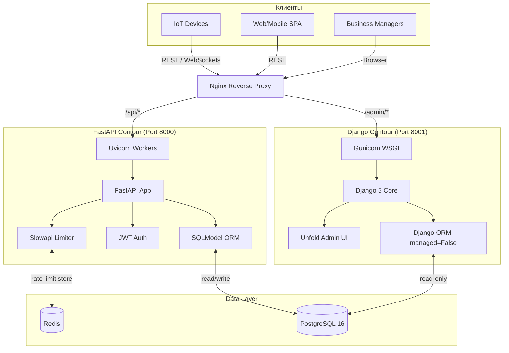

<div align="center">

# 🌐 Платформа микролизинга для Интернета вещей

[](https://www.python.org/)
[](https://fastapi.tiangolo.com/)
[](https://www.djangoproject.com/)
[](https://sqlmodel.tiangolo.com/)
[](https://docs.pytest.org/)
[](LICENSE)

**Микролизинг IoT-оборудования: аренда с оплатой по факту использования**

Enterprise-монорепозиторий · Событийный биллинг · Гибридная архитектура FastAPI + Django

</div>

---

## 📋 Описание

Enterprise-монорепозиторий, реализующий договор аренды оборудования не по времени, а по факту использования — **событийная оплата** (pay-per-use).

### Примеры использования

| Сценарий | Модель оплаты |
|----------|---------------|
| 💰 **3D-принтер** | Оплата за каждый распечатанный лист |
| 🚁 **Дрон-аграрий** | Оплата за каждый пройденный километр |
| 📡 **IoT-датчик** | Оплата за мегабайты переданных данных |

---

## 🧠 Почему именно эта архитектура?

Приложение решает проблему высоконагруженных биллинговых систем, где критически важны:

| Требование | Решение |
|------------|---------|
| **Идемпотентность** | Защита от двойных списаний при нестабильном Wi-Fi. IoT-устройства часто дублируют «пинг» — система гарантирует единоразовое списание. |
| **Валидация timestamp** | Защита от Replay-атак и корректная обработка запросов из прошлого. Устройства накапливают оффлайн-буфер и отправляют пакетами. |
| **Высокая нагрузка** | Миллионы мелких запросов с ограничением скорости (rate limiting) и полностью асинхронной обработкой. |

### Гибридный контур

- 🚀 **FastAPI (API-контур, порт 8000)** — принимает нагрузку, валидацию (Pydantic v2), асинхронную запись в БД
- 🎨 **Django 5 + Unfold (Admin-контур, порт 8001)** — Back-office для менеджеров. Не нагружает API, работает в режиме read-only с современным React-интерфейсом

---

## 🏗️ Архитектура системы



---

## 📁 Структура проекта

```
iot-micro-leasing/
├── api/                    # FastAPI-контур (API-шлюз)
│   ├── core/               # Celery, конфигурация, DI
│   ├── models/             # SQLModel-ORM (единая схема)
│   ├── routers/            # Эндпоинты FastAPI
│   └── main.py             # Точка входа Uvicorn
├── admin_panel/            # Django-контур (Back-office)
│   ├── core/               # Настройки Django
│   ├── apps/               # Приложения Django
│   └── manage.py
├── tests/                  # Pytest-сюита (полная изоляция)
├── docker-compose.yml      # PostgreSQL + Redis
├── pyproject.toml          # Зависимости проекта
└── .env.example            # Шаблон переменных окружения
```

---

## 🚀 Быстрый старт

### 1. Клонирование и установка

**Требуется Python 3.12+**

```bash
git clone https://github.com/Artem7898/iot-micro-leasing
cd iot-micro-leasing
python -m venv .venv
source .venv/bin/activate  # Windows: .venv\Scripts\activate
pip install -e ".[dev]"
```

### 2. Настройка окружения

```bash
cp .env.example .env
# Отредактируй .env: укажи данные PostgreSQL и Redis
# Для быстрого старта можно использовать SQLite
```

### 3. Инфраструктура (опционально)

```bash
docker-compose up -d postgres redis
```

### 4. Запуск сервисов

#### FastAPI (API-шлюз)

```bash
cd api
uvicorn main:app --host 0.0.0.0 --port 8000 --reload
```

🔗 **Swagger UI:** http://localhost:8000/api/docs

#### Redis (если не через Docker)

```bash
redis-server
```

#### Celery Worker (генерация PDF)

```bash
cd api
celery -A api.core.celery_app.celery_app worker --loglevel=info -Q invoices
```

#### Django Admin Panel

```bash
cd admin_panel
python manage.py migrate
python manage.py createsuperuser
python manage.py runserver 8001
```

🔗 **Админка:** http://localhost:8001/admin/

🔗 **Дашборд Redis:** http://localhost:8001/admin/redis-metrics/

---

## 🧪 Тестирование

Тесты полностью изолированы от внешней среды — не требуют PostgreSQL или Redis.

Используются **in-memory SQLite** и подмена зависимостей (DI):

```bash
pytest tests/ -v
```

---

## ⚙️ Технологический стек

| Компонент | Назначение |
|-----------|------------|
| **SQLModel + AsyncPG** | Единая ORM. SQLModel создаёт таблицы, которые читает Django без дублирования схемы |
| **Pydantic v2 (strict)** | Защита от мусорных данных с IoT-устройств. Строгая валидация на границе системы |
| **Slowapi + Redis** | Гибкая защита от DDoS и флуда с датчиков. Rate limiting с распределённым хранилищем |
| **Structlog** | Структурированное логирование в JSON. Готово для интеграции с ELK / Loki |
| **Django Unfold** | Современный React-интерфейс админ-панели. Тёмная тема, фильтры, дашборды |
| **JWT Auth** | Stateless-аутентификация для IoT-устройств и SPA-клиентов |
| **Celery** | Фоновая генерация PDF-инвойсов и отправка уведомлений |

---

## 🔒 Безопасность

- **Идемпотентные эндпоинты** — повторный запрос с тем же `idempotency-key` не приводит к двойному списанию
- **Replay-защита** — timestamp вне допустимого окна (±5 мин) отклоняется
- **Rate limiting** — персональные лимиты на уровне device_id + endpoint
- **JWT с коротким TTL** — access-токен 15 мин, refresh-токен 7 дней

---

## 📈 Масштабирование

| Уровень | Стратегия |
|---------|-----------|
| **Горизонтальное** | Nginx upstream → multiple Uvicorn workers. Django-контур масштабируется независимо |
| **База данных** | PostgreSQL read-replica для Django-контура. FastAPI пишет в master |
| **Кэш** | Redis Cluster для rate limiter и сессий |
| **Очереди** | Celery workers по количеству ядер. Отдельная очередь `invoices` для PDF |

---

## 👨‍💻 Автор

**Артем Алимпиев** —  Python Developer

- 🐙 GitHub: https://github.com/Artem7898
- 💼 LinkedIn: https://www.linkedin.com/in/artem-alimpiev/
- 📧 Email: alimpievne@gmail.com

---

## 📄 Лицензия

Распространяется под лицензией MIT. Подробности в файле [LICENSE](LICENSE).

---

<div align="center">

*Построено для миллионов IoT-событий. Идемпотентно. Асинхронно. Без двойных списаний.*

</div>
