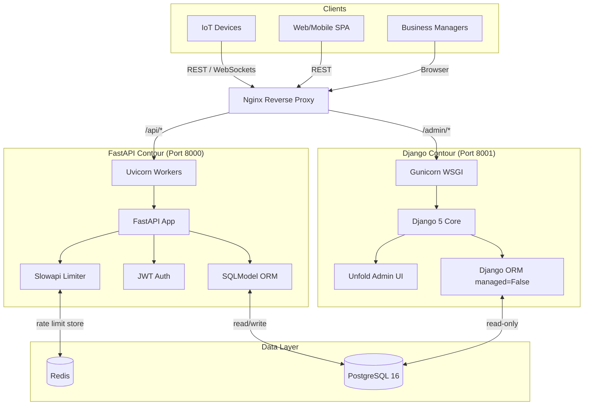

<div align="center">

# 🌐 IoT Micro-Leasing Platform

[](https://www.python.org/)
[](https://fastapi.tiangolo.com/)
[](https://www.djangoproject.com/)
[](https://sqlmodel.tiangolo.com/)
[](https://docs.pytest.org/)
[](LICENSE)

**IoT equipment micro-leasing: pay-per-use rental model**

Enterprise monorepo · Event-driven billing · Hybrid FastAPI + Django architecture

</div>

---

## 📋 Overview

An enterprise-grade monorepo implementing equipment rental contracts based not on time, but on **actual usage** — **event-driven billing** (pay-per-use).

### Usage Examples

| Scenario | Billing Model |
|----------|---------------|
| 💰 **3D Printer** | Pay per printed page |
| 🚁 **Agricultural Drone** | Pay per kilometer flown |
| 📡 **IoT Sensor** | Pay per megabyte of transmitted data |

---

## 🧠 Why This Architecture?

The application solves the problem of high-load billing systems where the following are critical:

| Requirement | Solution |
|-------------|----------|
| **Idempotency** | Protection against double charges on unstable Wi-Fi. IoT devices often duplicate "pings" — the system guarantees a single charge. |
| **Timestamp Validation** | Protection against Replay attacks and correct handling of delayed requests. Devices accumulate offline buffers and send in batches. |
| **High Load** | Millions of small requests with rate limiting and fully asynchronous processing. |

### Hybrid Contour

- 🚀 **FastAPI (API Contour, port 8000)** — handles load, validation (Pydantic v2), async database writes
- 🎨 **Django 5 + Unfold (Admin Contour, port 8001)** — Back-office for managers. Does not load the API, operates in read-only mode with a modern React interface

---

## 🏗️ System Architecture



---

## 📁 Project Structure

```
iot-micro-leasing/
├── api/                    # FastAPI contour (API gateway)
│   ├── core/               # Celery, config, DI
│   ├── models/             # SQLModel ORM (unified schema)
│   ├── routers/            # FastAPI endpoints
│   └── main.py             # Uvicorn entrypoint
├── admin_panel/            # Django contour (Back-office)
│   ├── core/               # Django settings
│   ├── apps/               # Django apps
│   └── manage.py
├── tests/                  # Pytest suite (full isolation)
├── docker-compose.yml      # PostgreSQL + Redis
├── pyproject.toml          # Project dependencies
└── .env.example            # Environment variables template
```

---

## 🚀 Quick Start

### 1. Clone & Install

**Requires Python 3.12+**

```bash
git clone <repo_url>
cd iot-micro-leasing
python -m venv .venv
source .venv/bin/activate  # Windows: .venv\Scripts\activate
pip install -e ".[dev]"
```

### 2. Environment Setup

```bash
cp .env.example .env
# Edit .env: set PostgreSQL and Redis credentials
# For quick start you can use SQLite
```

### 3. Infrastructure (Optional)

```bash
docker-compose up -d postgres redis
```

### 4. Launch Services

#### FastAPI (API Gateway)

```bash
cd api
uvicorn main:app --host 0.0.0.0 --port 8000 --reload
```

🔗 **Swagger UI:** http://localhost:8000/api/docs

#### Redis (if not via Docker)

```bash
redis-server
```

#### Celery Worker (PDF Generation)

```bash
cd api
celery -A api.core.celery_app.celery_app worker --loglevel=info -Q invoices
```

#### Django Admin Panel

```bash
cd admin_panel
python manage.py migrate
python manage.py createsuperuser
python manage.py runserver 8001
```

🔗 **Admin Panel:** http://localhost:8001/admin/

🔗 **Redis Dashboard:** http://localhost:8001/admin/redis-metrics/

---

## 🧪 Testing

Tests are fully isolated from the external environment — no PostgreSQL or Redis required.

Uses **in-memory SQLite** and dependency injection (DI):

```bash
pytest tests/ -v
```

---

## ⚙️ Tech Stack

| Component | Purpose |
|-----------|---------|
| **SQLModel + AsyncPG** | Unified ORM. SQLModel creates tables that Django reads without schema duplication |
| **Pydantic v2 (strict)** | Protection against garbage data from IoT devices. Strict validation at the system boundary |
| **Slowapi + Redis** | Flexible DDoS and sensor flood protection. Rate limiting with distributed storage |
| **Structlog** | Structured JSON logging. Ready for ELK / Loki integration |
| **Django Unfold** | Modern React-based admin interface. Dark theme, filters, dashboards |
| **JWT Auth** | Stateless authentication for IoT devices and SPA clients |
| **Celery** | Background PDF invoice generation and notification delivery |

---

## 🔒 Security

- **Idempotent Endpoints** — repeated request with the same `idempotency-key` does not result in double charging
- **Replay Protection** — timestamps outside the allowed window (±5 min) are rejected
- **Rate Limiting** — personalized limits at the device_id + endpoint level
- **JWT with Short TTL** — access token 15 min, refresh token 7 days

---

## 📈 Scaling

| Level | Strategy |
|-------|----------|
| **Horizontal** | Nginx upstream → multiple Uvicorn workers. Django contour scales independently |
| **Database** | PostgreSQL read-replica for Django contour. FastAPI writes to master |
| **Cache** | Redis Cluster for rate limiter and sessions |
| **Queues** | Celery workers per CPU core. Separate `invoices` queue for PDF |

---

## 👨‍💻 Author

**Artem Alimpiev** — Senior Python Developer

- 🐙 GitHub: [@your-github](https://github.com/your-github)
- 💼 LinkedIn: [linkedin.com/in/your-profile](https://linkedin.com/in/your-profile)
- 📧 Email: your.email@example.com

---

## 📄 License

Distributed under the MIT License. See [LICENSE](LICENSE) for details.

---

<div align="center">

*Built for millions of IoT events. Idempotent. Async. No double charges.*

</div>
